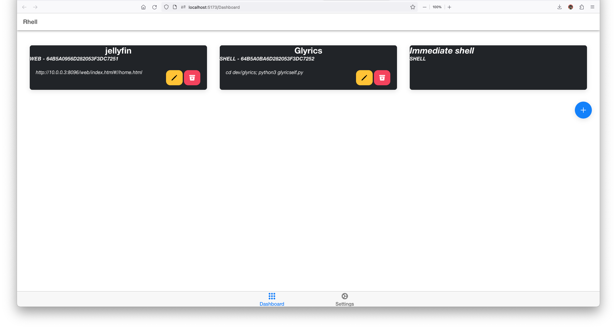
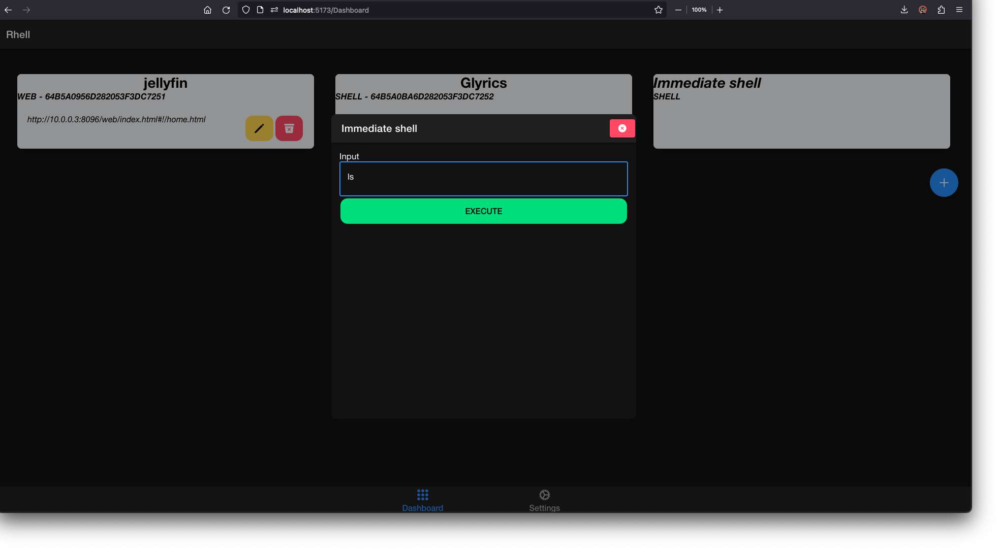
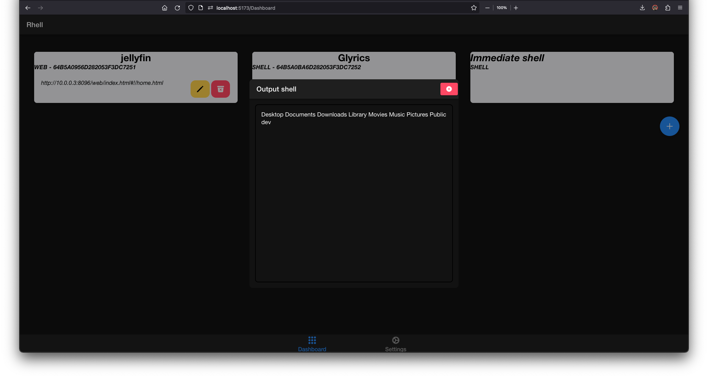
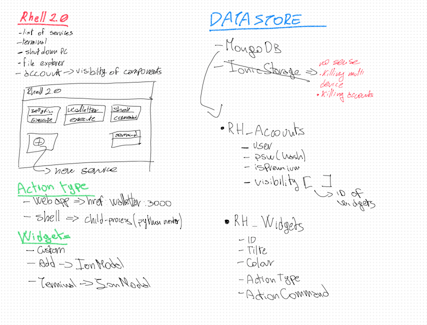

# Rhell

Rhell wanna be a home directory of webservices and shell script executor via HTTPS.

## The idea

I want to have a remote dashbaord where I can put all the links to my utility web apps (like jellyfin or <a href="https://github.com/albertomorini/walletter">Walletter</a>...) but also, run some shell script (like <a href="https://github.com/albertomorini/nexter">Nexter</a> or <a href="https://github.com/albertomorini/glyrics">Glyrics</a>).

All of this, from my iPad or my phone.

And also, want to execute some immediate shell command like `cd Downloads; ls`.

### Immediate command

## Architecture

Three tier 

- **Presentation**: React (w/ IonicFramework)
     - I'll use a tons of hooks (state,effect,ref) and context
- **Application**: NodeJS
- **Data**: MongoJS
     - To store user and relative widgets

## USAGE

- nodejs 
     w/ some libraries
- react (react-scripts) or ionic framework
- mongoDB

**NB**: The user will be created on server side for security concern.
> Users can execute shell script like `rm -rf importantFiles/*` so I thought it will be better to create on the server side and avoid a sign up page on client

## *Draft*

