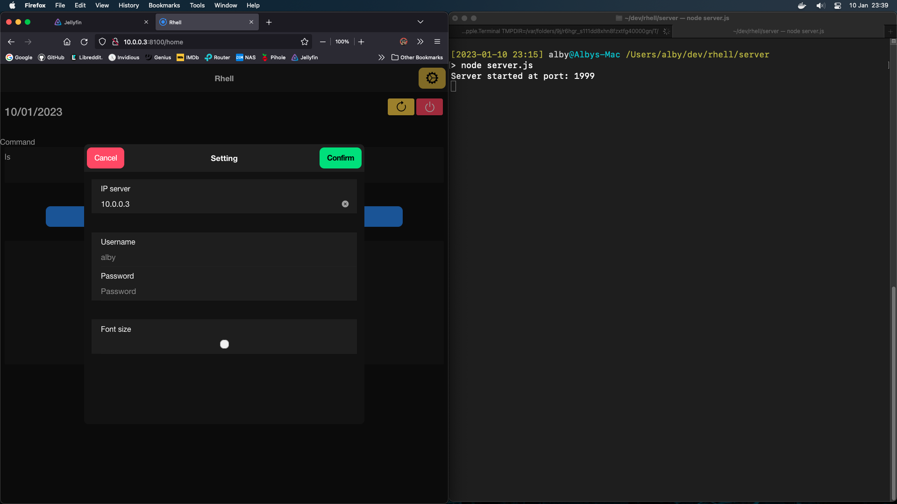
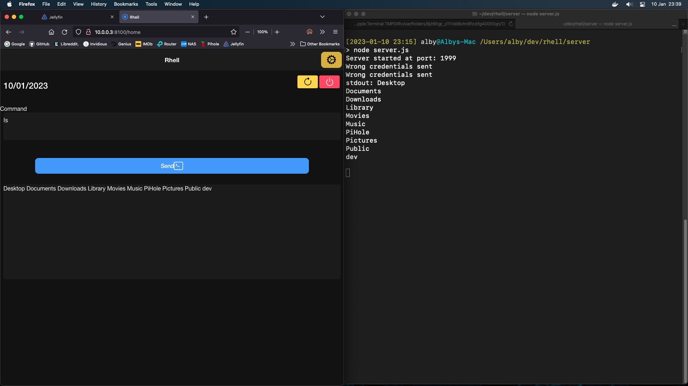
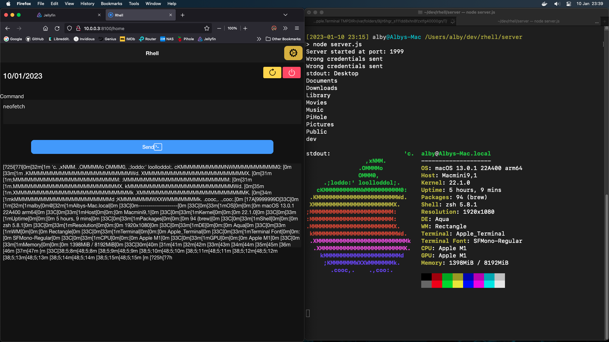

# Rhell

Rhell is a (draft/working progress) client-server project which create a remote shell (ssh like) via HTTPS.

Client can send a simple string to the server, which will execute it in the terminal.
Every message will be in HTTPS, and contains an authentication made by username and password (hashed via MD5)
(Even if now is on HTTP).

## Architecture

### Server
Made with NodeJS.
Create an HTTP server on port 1999, every packet will be authenticated via basic auth and will contains the bash command to execute.

### Client
Made with Ionic/React.
Allows user to set up the credentials and the server's IP, then the user will be able to digit a bash command and send to the server.

## TODO:

[ ] https

## Proofing

